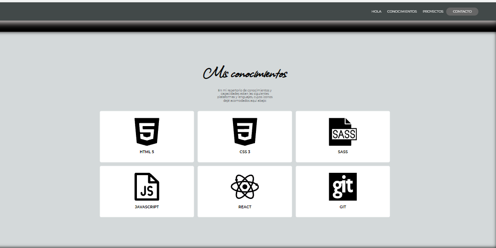
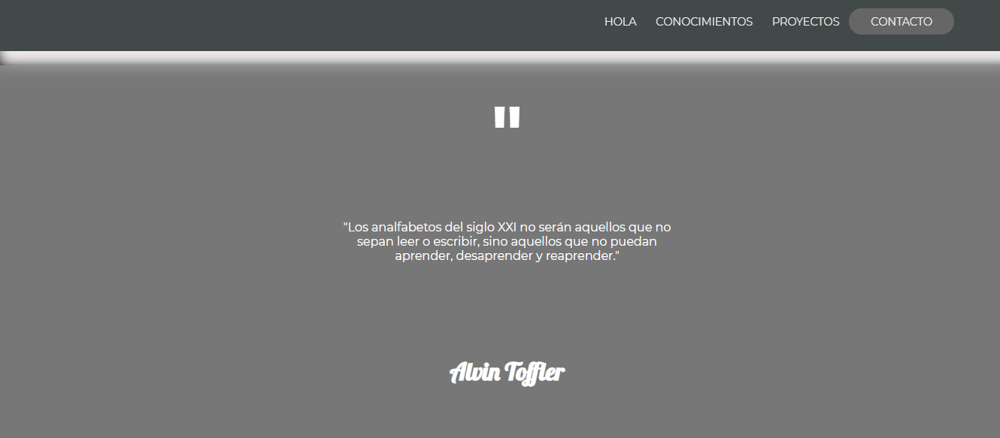
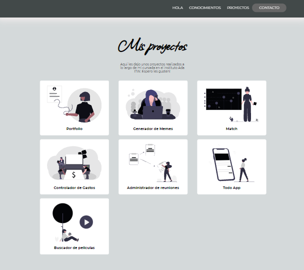
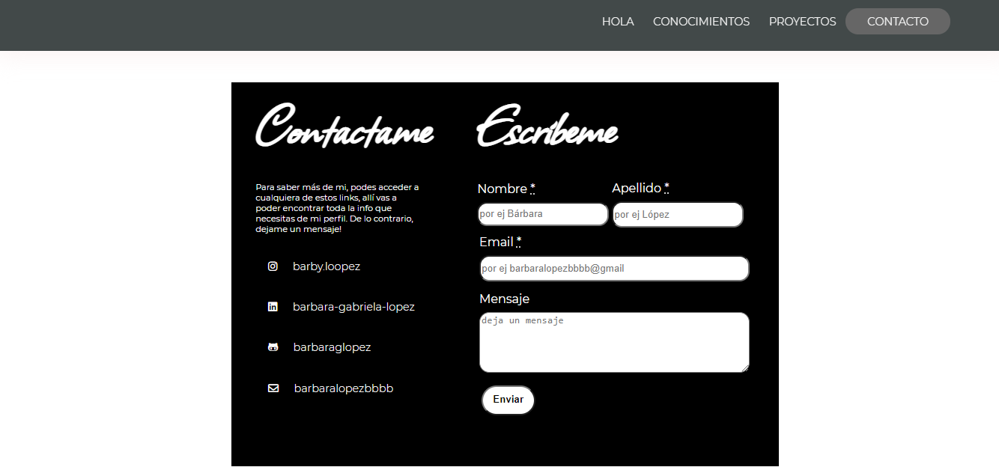

# Mi portfolio Bárbara Lápez
*Mi primer proyecto en Ada, espero les guste!*

*En la primera sección podemos visualizar una introducción al contenido que cuenta con una barra de navegacioón con cuatro atajos a las respectivas secciones. Luego una breve introduccion que cuenta con*:

- El saludo
- Nombre y apellido de la desarrolladora
- Una breve descripción

*En la segunda seccion tenemos una representación en grillas que contienen iconos de diferentes lenguajes de programación, plataformas y programas que aprendimos a utilizar a lo largo de la cursada. Los mismos son*:
1. HTML
2. CSS
3. SASS
4. JAVASCRIPT
5. REACT
6. GIT

*En la tercera sección tenemos la cita de un gran visionario pedagógico*
>Los analfabetos del siglo XXI no serán aquellos que no sepan leer o escribir, sino aquellos que no puedan aprender, desaprender y reaprender.

*En la cuarta seccion tenemos una grilla representativa de los proyectos que suceden una vez finalizado este mismo, estos son:*

1. Portfolio
2. Generador de memes
3. Match
4. Controlador de gastos
5. Administrador de reuniones
6. Todo app
7. Buscador de peliculas

*La ultima sección está destinada a recibir feedback de parte del usuario, tenemos adjuntados links para optimizar la rapidez de comunicación y un formulario sencillo listo para depositar cualquier mensaje. A continuación una lista de links a mis redes sociales si deseas contactarme!*

- [linkinstagram](https://www.instagram.com/)
- [linklinkedin](https://www.linkedin.com/in/barbara-gabriela-lopez/)
- [linkgithubrepositiries](https://github.com/barbaraglopez)

*Finalizamos con el footer, en color gris, con atajos a las secciones y links a mis redes sociales.*
